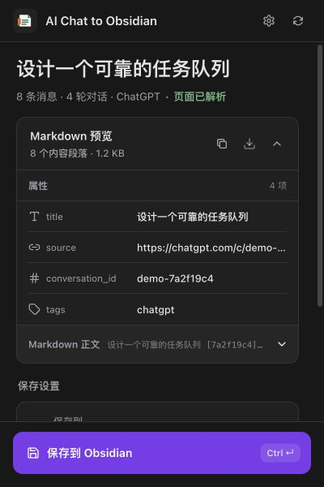
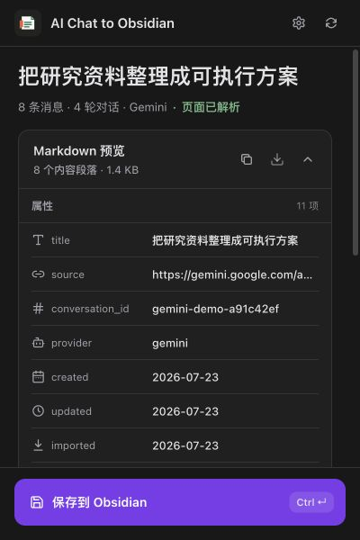
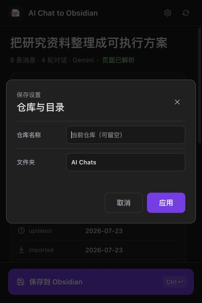

# AI Chat to Obsidian

一个将 ChatGPT 和 Gemini 网页对话完整保存为 Obsidian Markdown 的 Chrome、Edge、Firefox 扩展。扩展在本地读取当前对话、预览属性与正文、校验完整性，再通过剪贴板和 `obsidian://new` 写入 Obsidian 仓库（Vault）；对话不会上传到第三方服务。

| 默认预览 | 详细属性 | 仓库与目录 |
| --- | --- | --- |
|  |  |  |

## 功能

- 支持 `chatgpt.com`、`chat.openai.com` 和 `gemini.google.com`
- 导出当前 User/Assistant 对话，保留消息顺序与轮数
- 扫描窗口化长列表，并在读取后恢复原滚动位置
- 保留标题、段落、列表、引用、代码块、表格、链接和 LaTeX 公式
- 保存前校验 Markdown 消息段数和 UTF-8 大小，阻止只剩标题的空笔记
- 在弹窗中分别预览 Obsidian 属性和 Markdown 正文
- 支持指定 Obsidian 仓库、相对文件夹、后台保存和详细属性
- 后台保存与详细属性可直接在主界面切换，仓库和目录在独立对话框中编辑
- 提供复制 Markdown 和下载 `.md` 两种备用方式
- 支持 `Command/Ctrl + Enter` 快速保存，并显示保存中、成功和失败状态
- Chromium 和 Firefox 使用同一套导出、校验与保存逻辑
- 使用固定深色界面，弹窗尺寸为 `400 × 600`

## 安装

项目没有第三方运行时依赖。使用 Node.js 20 或更高版本构建：

```bash
npm run build
```

### Chrome / Edge

1. 打开 `chrome://extensions` 或 `edge://extensions`。
2. 开启“开发者模式”。
3. 点击“加载已解压的扩展程序”。
4. 选择本项目的 `dist/chromium` 文件夹。
5. 将 **AI Chat to Obsidian** 固定到工具栏。

### Firefox

1. 打开 `about:debugging#/runtime/this-firefox`。
2. 点击“临时载入附加组件”。
3. 选择 `dist/firefox/manifest.json`。
4. 将 **AI Chat to Obsidian** 固定到工具栏。

Firefox 的临时扩展会在浏览器重启后移除，适合本地开发；长期安装需要 Mozilla Add-ons 签名。目标环境为 Chrome/Edge 116 及以上、Firefox 128 及以上。Obsidian 桌面应用需要至少运行过一次，以注册 `obsidian://` 协议。

## 使用

1. 打开一条 ChatGPT 或 Gemini 对话，等待当前回答生成完成。
2. 点击浏览器工具栏中的扩展图标。
3. 核对平台、消息数量、轮数、读取状态以及属性预览。
4. 按需展开“Markdown 正文”，或调整“后台保存”和“详细属性”。
5. 点击“保存到 Obsidian”，也可以按 `Command/Ctrl + Enter`。
6. 浏览器首次使用时如询问是否允许打开 Obsidian，选择允许。

新安装默认保存到当前或最近打开的 Obsidian 仓库下的 `AI Chats/`。从旧版本升级时会保留已经设置的 `ChatGPT/` 或其他目录，不会自动迁移。主界面的两个开关会立即保存；右上角设置按钮和保存位置整行都可打开“仓库与目录”对话框：

- **仓库名称**：留空时使用 Obsidian 当前或最近打开的仓库。
- **文件夹**：仓库内的相对路径。
- **后台保存**：创建或更新文件，但不在 Obsidian 中打开新笔记。
- **详细属性**：额外写入时间、消息数、轮数和提取方式。

同一条对话使用稳定文件名并发送 `overwrite=true`，重复保存会更新原笔记。

## 弹窗预览

“Markdown 预览”默认展开，并把待写入内容分成两部分：

- **属性**：默认显示 `title`、`source`、`conversation_id` 和平台标签；开启“详细属性”后会立即扩展为完整属性列表。
- **Markdown 正文**：显示标题和 User/Assistant 消息正文，不重复展示 YAML frontmatter，可独立展开或收起。

预览标题同时显示正文段落数和 UTF-8 大小。复制与下载按钮始终使用经过完整性校验的完整 Markdown，包括属性、标题和正文。

## 保存原理

扩展先将经过完整性校验的 Markdown 写入系统剪贴板，再打开类似下面的 URI：

```text
obsidian://new?file=AI%20Chats%2FConversation.md&overwrite=true&silent=true&clipboard
```

长对话正文不会放进 URL，因此不受 URI 长度限制。Obsidian 从本地剪贴板读取正文，并在仓库中创建或覆盖文件。如果自定义协议不可用，仍可使用 Markdown 预览标题栏中的复制或下载按钮。

发送前会核对生成文档中的 `## User`、`## Assistant` 段落数量与读取到的消息数量。正文为空、段落缺失或发生截断时，扩展会停止保存并提示重新读取。

## 输出格式

默认属性保持精简：

```yaml
---
title: "把研究资料整理成可执行方案"
source: "https://gemini.google.com/app/..."
conversation_id: "..."
tags:
  - gemini
---
```

ChatGPT 笔记对应使用 `chatgpt` 标签。开启“详细属性”后还会加入：

```yaml
provider: "gemini"
created: "2026-07-21T01:00:00.000Z"
updated: "2026-07-21T01:20:00.000Z"
imported: "2026-07-21T08:00:00.000Z"
messages: 8
rounds: 4
extraction: "api"
```

这些内容是 Obsidian 的 YAML 笔记属性，不是正文标签。默认关闭“详细属性”，因此不会写入平台、时间、消息数等扩展字段；`source`、`conversation_id` 和平台标签用于追溯与识别同一条对话。弹窗属性列表和最终 YAML 由同一份结构化数据生成，避免预览与实际文件不一致。

## 读取状态

- **页面已解析**：已取得可导出的消息，并确认页面扫描完整。
- **页面可能不完整**：未能确认到达对话列表两端，保存前应核对消息数量和预览正文。

平台名称显示在消息数和轮数旁。ChatGPT 优先读取当前对话的结构化消息树，只导出当前选中的回答分支；结构化数据不可用时改为扫描页面。Gemini 没有本扩展可依赖的公开导出接口，因此适配器读取语义化页面元素，并专门处理长对话滚动容器。网页结构变化后可能需要更新选择器。

## 隐私与权限

- `activeTab`、站点权限和 `scripting`：只读取当前打开的 ChatGPT 或 Gemini 对话。
- `clipboardWrite`：把完整 Markdown 交给 Obsidian。
- `storage`：保存 Vault、文件夹和元数据偏好。
- `downloads`：提供 Markdown 下载备用方式。
- 对话不会上传到开发者服务器或第三方服务。
- ChatGPT 会话令牌只在页面上下文中用于读取当前对话，不会存入扩展设置。
- HTML 转换会移除脚本、按钮、SVG、表单控件和危险 URL scheme。
- 扩展不会创建 Gemini 公共分享链接。

权限仅精确覆盖三个域名，不包含宽泛的 Google 或全站访问权限。升级到 `0.5.0` 后，浏览器可能为新增的 `gemini.google.com` 权限显示一次确认。

## 已知限制

- ChatGPT 的网页结构化接口和 Gemini 的页面 DOM 都可能变化。
- 当前只导出正在查看的 ChatGPT 回答分支，不导出全部“重新生成”分支。
- 图片、Canvas、音频和附件暂不下载到 Vault；可访问的 HTTPS 链接会尽量保留。
- 首次调用自定义协议时，浏览器可能显示“打开 Obsidian”确认。
- 保存依赖 Obsidian 读取系统剪贴板；受限制的 Linux/Wayland 环境可能需要调整权限。
- 暂不支持批量导入历史数据导出包。

## 从旧版本升级

`0.5.0` 新增 Gemini、统一品牌和平台属性。Chrome/Edge 在扩展管理页重新加载原来的 `dist/chromium` 目录；Firefox 重新临时载入 `dist/firefox/manifest.json`。Firefox 扩展 ID 和设置存储键没有变化，现有 Vault、文件夹和偏好会保留。

`0.4.0` 已修复旧版 Obsidian URI 编码可能创建空笔记的问题，并加入正文完整性保护。旧的空文件不会自动删除，请确认没有有效内容后自行处理。

## 开发与测试

```bash
npm test
npm run check
npm run build
npm run smoke:gemini
```

自动化测试覆盖平台路由、恶意相似域名拒绝、ChatGPT 消息树、Gemini DOM 归一化、结构化属性与 YAML 一致性、正文完整性、剪贴板逐字节传输、Obsidian URI、下载与设置持久化。

`npm run smoke:gemini` 会自行启动临时本地服务器与无头 Firefox，验证 Gemini 的普通代码块、CodeMirror、表格、公式、来源和危险链接清理。

Firefox 真实扩展冒烟测试使用 WebDriver BiDi，同时验证 ChatGPT 和 Gemini demo、`400 × 600` 布局、属性预览、折叠交互、内联设置、复制下载以及保存状态：

```bash
/Applications/Firefox.app/Contents/MacOS/firefox \
  --headless \
  --remote-debugging-port 9224 \
  --profile /tmp/ai-chat-to-obsidian-firefox

npm run smoke:firefox -- \
  9224 \
  /tmp/ai-chat-to-obsidian-firefox \
  dist/firefox
```

本地浏览器 fixture 可通过静态服务器运行：

```bash
python3 -m http.server 4173 --bind 127.0.0.1
```

- `http://127.0.0.1:4173/fixtures/dom-fixture.html`
- `http://127.0.0.1:4173/fixtures/virtualized-chat.html`
- `http://127.0.0.1:4173/fixtures/gemini-dom-fixture.html`
- `http://127.0.0.1:4173/fixtures/gemini-virtualized-chat.html`
- `http://127.0.0.1:4173/popup.html?demo=1&provider=chatgpt&theme=light`
- `http://127.0.0.1:4173/popup.html?demo=1&provider=gemini&theme=dark`

## 项目结构

```text
manifest.json / manifest.firefox.json   Chromium / Firefox Manifest
background.js                           下载与 Obsidian URI 安全跳转
popup.html / popup.js / styles.css      属性与正文预览、设置和保存流程
src/providers.js                        平台元数据与严格 URL 路由
src/extract-page.js                     ChatGPT API 与 DOM 提取器
src/extract-gemini.js                   Gemini DOM 与长对话扫描器
src/conversation.js                     统一会话模型、结构化属性和 Markdown 生成
src/html-to-markdown.js                 富文本到 Obsidian Markdown 转换
src/export-payload.js                   正文完整性检查与大小统计
src/obsidian.js                         Obsidian URI 构造与校验
src/obsidian-transport.js               剪贴板与 URI 发送顺序
src/settings.js                         Vault 和导出偏好持久化
src/download.js                         Markdown 下载备用路径
scripts/build.mjs                       双浏览器发行目录生成
scripts/firefox-smoke.mjs               Firefox WebDriver BiDi 冒烟测试
scripts/gemini-fixture-smoke.mjs        Gemini DOM 与富文本浏览器测试
tests/                                  Node.js 自动化测试
fixtures/                               浏览器提取回归页面
```

## License

[MIT](LICENSE)
